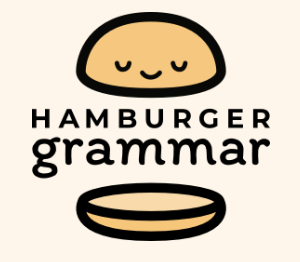
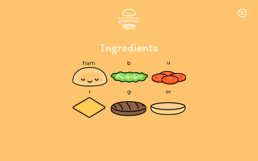
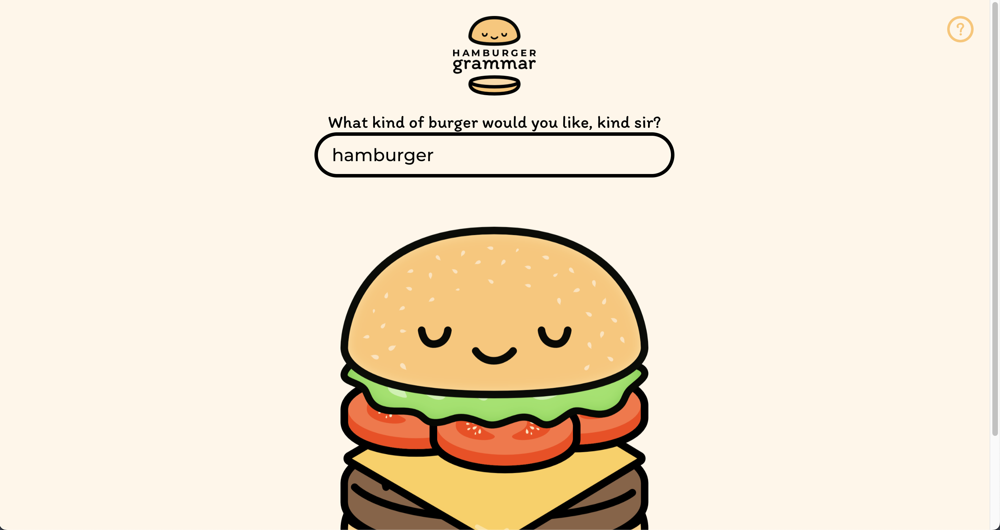

    

# Hamburger Grammar

[Live Project](http://localhost:3000/?id=hamburger)

*The unpopular meme brought to life!*

An app in which different segments of the word "hamburger" correspond to a specific hamburger ingredient. The user can type out their order (a new word using the segments of "hamburger"), and the app will reactively deliver the desired burger for the user!

## Screenshots

The ingredient list

The Main Screen

## Features

- Beautiful, hand-drawn and home-cooked burgers!
- Link Sharing (enables users to copy their link to save or send their burger order)

## What I Learned

- This was my first TypeScript project! (TypeScript is an AMAZING developer tool)
- Learned some intricasies of CSS, like z-index and the stacking context for stacking the images of the ingredients on top of each other.
- How to create a simple modal.
- The History browser API
- *That I love making silly things that let me take life less seriously*

---

This project was bootstrapped with [Create React App](https://github.com/facebook/create-react-app).

## Available Scripts

In the project directory, you can run:

### `npm start`

Runs the app in the development mode.\
Open [http://localhost:3000](http://localhost:3000) to view it in the browser.

The page will reload if you make edits.\
You will also see any lint errors in the console.

### `npm test`

Launches the test runner in the interactive watch mode.\
See the section about [running tests](https://facebook.github.io/create-react-app/docs/running-tests) for more information.

### `npm run build`

Builds the app for production to the `build` folder.\
It correctly bundles React in production mode and optimizes the build for the best performance.

The build is minified and the filenames include the hashes.\
Your app is ready to be deployed!

See the section about [deployment](https://facebook.github.io/create-react-app/docs/deployment) for more information.

### `npm run eject`

**Note: this is a one-way operation. Once you `eject`, you can’t go back!**

If you aren’t satisfied with the build tool and configuration choices, you can `eject` at any time. This command will remove the single build dependency from your project.

Instead, it will copy all the configuration files and the transitive dependencies (webpack, Babel, ESLint, etc) right into your project so you have full control over them. All of the commands except `eject` will still work, but they will point to the copied scripts so you can tweak them. At this point you’re on your own.

You don’t have to ever use `eject`. The curated feature set is suitable for small and middle deployments, and you shouldn’t feel obligated to use this feature. However we understand that this tool wouldn’t be useful if you couldn’t customize it when you are ready for it.

## Learn More

You can learn more in the [Create React App documentation](https://facebook.github.io/create-react-app/docs/getting-started).

To learn React, check out the [React documentation](https://reactjs.org/).
